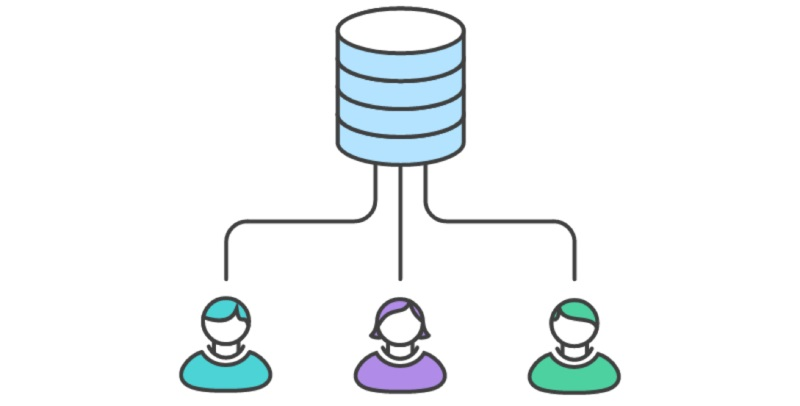

Существует множество способов применения Git в проекте, а также сотрудничества с другими разработчиками. Помимо использования Git для контроля версий кода вашего проекта, его можно использовать для координации того, как другие работают над проектом. Эффективнее всего этого можно достичь, применив какую-либо __модель ветвления.__

Наиболее эффективным для проектов является наличие удалённого репозитория. Модель ветвления это не правило, которому нужно следовать, а скорее путеводитель. Поэтому можете просто выбрать определённые аспекты и сочетать их так как вам нужно.

Существует несколько моделей ветвления, которые вы можете рассмотреть для использования в своём проекте. Для каждой описаны суть работы и цель применения. Вы можете почитать о них [здесь](https://proglib.io/p/git-workflow) или [здесь](https://javarush.ru/groups/posts/2693-komandnaja-rabota-bez-putanicih-razbiraem-strategii-vetvlenija-v-gite).

---

___Форк___ — собственный проект, основанный на другом проекте.

Fork позволяет сохранить связь с проектом-родителем __->__ получать и передавать изменения; это используется в модели ветвления _Forking Workflow_.

В функционале Git нет команды, которая позволит вам создать свой форк. Но есть возможность работать с [удалёнными репозиториями](remote%20repository.md), благодаря которой различные хостинги IT-проектов реализовывают функционал создания форка.

__!__ _На_ GitHub _форк создаётся с помощью кнопки «fork», которая расположена в интерфейсе при просмотре чужих проектов._