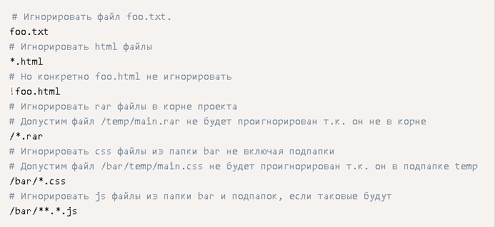

В большинстве проектов будут __файлы__ или целые директории, которые __нельзя добавлять в репозиторий__. Вы можете удостовериться, что они случайно туда не попадут при помощи файла _.gitignore_

Вручную создайте файл под названием .gitignore и сохраните его в директорию проекта. __->__
Внутри файла перечислите названия файлов/папок, которые нужно игнорировать, каждoe с новой строки. __->__
Файл .gitignore должен быть добавлен и отправлен на сервер, как любой другой файл в проекте.

---
Вот хорошие примеры файлов, которые нужно игнорировать: локальные настройки проекта, учётные данные, сведения об ошибках, библиотеки, промежуточные результаты компиляции и др.

Основные __правила синтаксиса__ этого файла:
- одна строка = одно правило;
- \# - комментирует строку;
- пустые строки игнорируются;
- / - каталог, где находится файл gitignore;
- \* - заменяет 0 и более символов;
- ? - заменяет 0 или 1 символ;
- /**/ - любые каталоги;
- ! - логическое "НЕ", применяется для исключения файлов и папок из общих правил;
- \ - экранирование символов.

__!__ _Для игнорирования всей директории правило должно оканчиваться на слеш, иначе Git будет думать что это название файла._

### Пример .gitignore файла

---
___Как игнорировать файлы, которые уже отслеживаются?___
Если вы добавили файл или папку в .gitignore, после того как они попали в репозиторий, то их необходимо удалить из репозитория командой:

    git rm --cached <file>

Например, убрать папку _storage/framework/cache/_. 

    git rm -r --cached "storage/framework/cache/"

Обратите внимание: вначале отсутствует слеш.